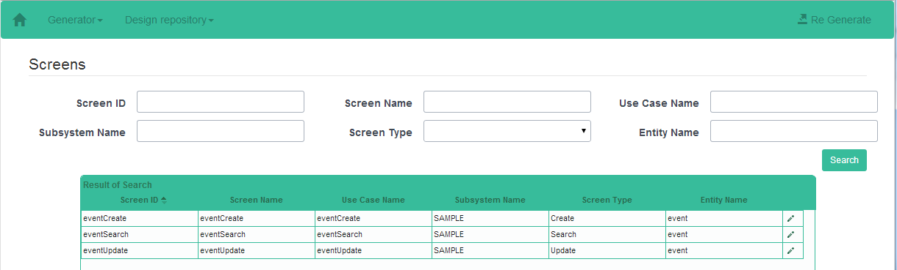
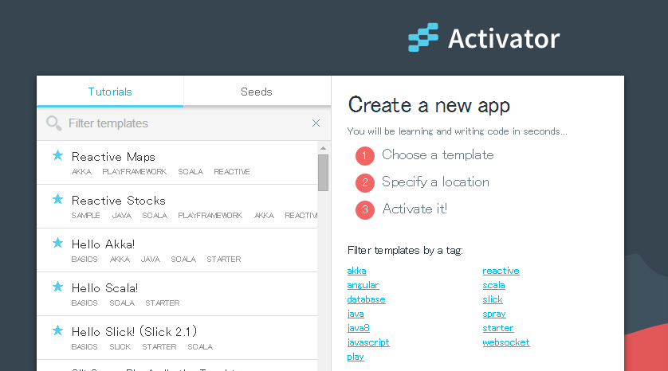

## Skalholtの概要
SkalholtはScalaでのWebアプリケーションの開発を効率化するソースコード自動生成ツールです。データベーススキーマからPlay FrameworkとSlickに準拠したソースコードを生成に加え、スキーマからは得ることが出来ない情報を付加したソースコードの生成を実現します。

DBスキーマを準備しSkalholtを実行すれば、シンプルなCRUDアプリケーションが作成できます。SkalholtはWebアプリケーションとして動作しますので、自動生成された設計内容をブラウザから編集することが出来ます。これによりScaffoldから一歩進んだアプリケーションを構築することが出来ます。

Webアプリケーションを開発する際のフレームワークとしてスターンダードとなりつつあるPlay FrameworkとSlickを利用する際の開発を効率化すること、また、簡単に開発をスタートできることでScalaやPlayの習得に障壁を感じている方に対して、その習得を促進することを狙いとしています。


### 特徴
1. Play Framework、Slickに対応したソースコードを生成
2. DBスキーマからソースコードを生成するScaffold機能
3. アプリケーション構造を設計リポジトリに保持し、その内容を編集することでアプリケーションが進化
4. 「Typesafe Activator」のテンプレートとして提供するためインストール不要


## リリースノート
* 2014/9/5 Ver0.1.0 First Release


## 構成
SkalholtはPlay FrameworkをベースとしたWebアプリケーションで[「Typesafe Activator」](http://typesafe.com/activator)のテンプレートとして提供します。


Activatorから生成したプロジェクトは以下の構成になっています。

```
▶ Skalholt-Template
　 ├ app
　 │   開発するアプリケーションのソースコード（本ツールにより自動生成）
　 ├ conf
　 │   設定ファイル
　 ├ skalholt/lib
　 │   Skalholtのライブラリ群
　 ├ skalholt.h2.db
　 │   設計リポジトリのデータファイル（H2 Database）
　 └ skalholt-ui.bat（skalholt-ui）
　　　　　Skalholt起動バッチ（シェル）
```

Skalholtは以下の様な流れで利用します。

#### 1. 自動生成を実行すると業務データベースからアプリケーション生成に必要な情報を設計リポジトリに登録し、ソースコードを生成する。
   (1) 設計リポジトリの作成  
   (2) 業務データベースからソースコードの生成  
   (3) 設計リポジトリからソースコードの生成  

#### 2. 設計リポジトリの内容を編集し、ソースコードを再生成する。
   (4) 設計リポジトリの内容を編集  
   (5) ソースコードの再生成  


構築するWebアプリケーションの構成はPlay Frameworkに準拠し、「Controller」「View」等は設計リポジトリから、「Model」等はDBスキーマから自動生成します。
設計リポジトリは以下の様な構成です。


Skalholtは以下のDBMSで動作確認を行っています。
* H2Database
* PostgreSQL


## インストール
Skalholtを利用するために特別なツールのインストールは不要です。Typesafe Activatorさえインストールされていれば使用できます。
Typesafe Activatorの実行に必要な環境と環境構築方法はTypesafe.comの[「TYPESAFE REACTIVE PLATFORM GET STARTED」](http://typesafe.com/platform/getstarted)を参照してください。


## 設定(業務データベースの準備)
アプリケーションが使用するDBスキーマを準備し、「application.conf」に接続先情報を設定してください。

#### application.conf
```
db.default.driver=org.h2.Driver
db.default.url="jdbc:h2:tcp://localhost:9092/skalholt;SCHEMA=SAMPLE"
db.default.user=sa
db.default.password=""
```
データベース接続設定の詳細は[Play公式ドキュメント(リンク先はバージョン2.3)](https://www.playframework.com/documentation/2.3.x/ScalaDatabase)を参照してください。


## 利用方法
### 前準備
* ブランクプロジェクトの作成
```
C:\work>activator new myapp skalholt
```
 　※Typesafe ActivatorはUIを利用してWebブラウザ上での操作によりブランクプロジェクトを作成することが出来ます。作成方法は「ActivatorのUIを利用する」を参照してください。

* プロジェクトディレクトリでActivator起動
```
C:\work>cd myapp
C:\work\myapp>activator
```

* コンパイル
```
[myapp] $compile
```

* H2 Database起動（設計リポジトリとサンプルの業務データベースとして利用します。）
```
[myapp] $ h2-browser
```

* アプリケーション起動
```
[myapp] $ run
```


* [http://localhost:9000/](http://localhost:9000/ ) へアクセス  
  メニューにはまだ何も表示されません。

     

## ソースコードのジェネレート
#### 1. 自動生成を実行すると業務データベースからアプリケーション生成に必要な情報を設計リポジトリに登録し、ソースコードを生成する。
* Skalholtの起動
```
C:\work\myapp>skalholt-ui
```
* [http://localhost:9001/](http://localhost:9001/) へアクセス


* 「Generate」画面にソースコード出力先と自動生成の元となるDBスキーマへの接続情報を設定し「Create design repository and generate source code」をクリック
* [http://localhost:9000/](http://localhost:9000/) へアクセス  
   メニューにアプリケーションへアクセスするためのリンクが生成されています。  

     


#### 2. 設計リポジトリの内容を編集し、ソースコードを再生成する。
* [http://localhost:9001/](http://localhost:9001/) へアクセス
* 「Screens」画面から変更したい画面を選択



* 「Screen Detail」画面に画面情報を編集


* 画面右上の「Re Generate」からソースコードを再生成
* どんな変更ができるのか？
 * HTMLコンポーネントの種類を変更したい
 * バリデーションの内容を変更したい
 * 検索方法を変更したい
 * 入力項目を追加・削除したい


### ActivatorのUIを利用する
Typesafe ActivatorのUIを利用する場合は、Activatorをインストールしたディレクトリにある「activator」（Linux ｏｒ Macの場合）、または、「avtivator.bat」（Windowsの場合）を実行してください。




また、コマンドプロンプトから「activator ui」の実行により起動することも出来ます。
```
C:\work>activator ui
```
Typesafe Activatorの詳細な利用方法については、Typesafe.comの[「TYPESAFE ACTIVATOR DOCUMENTATION」](http://typesafe.com/activator/docs)を参照してください。


## 問い合わせ先
フィードバックや不明点等以下までお問い合わせ下さい。  
TIS株式会社  
コーポレート本部　戦略技術センター  
Skalholt 担当宛  
smart_dev@ml.tis.co.jp


## ライセンス
Skalholtは[Apache License version2.0](http://www.apache.org/licenses/LICENSE-2.0)のもとにリリースされています。